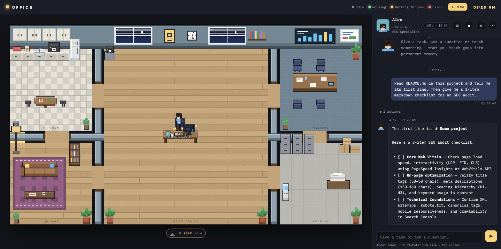
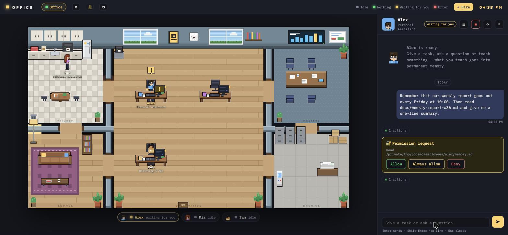
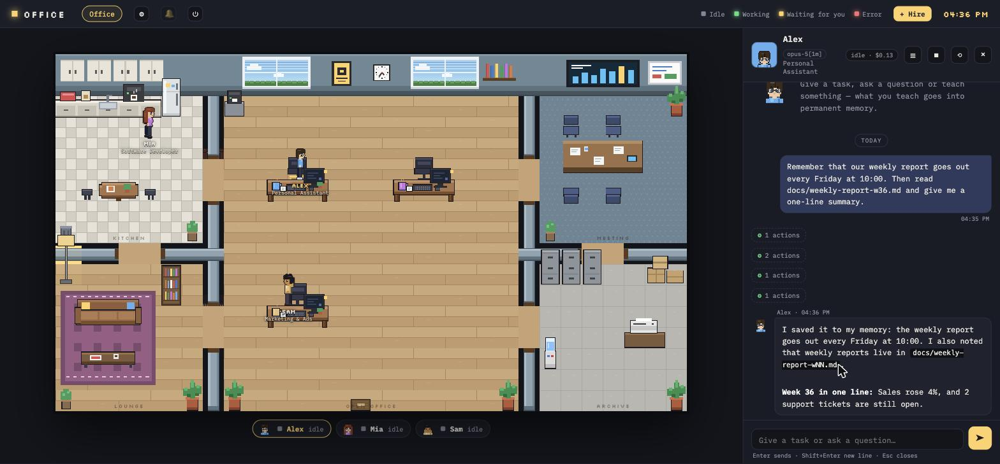
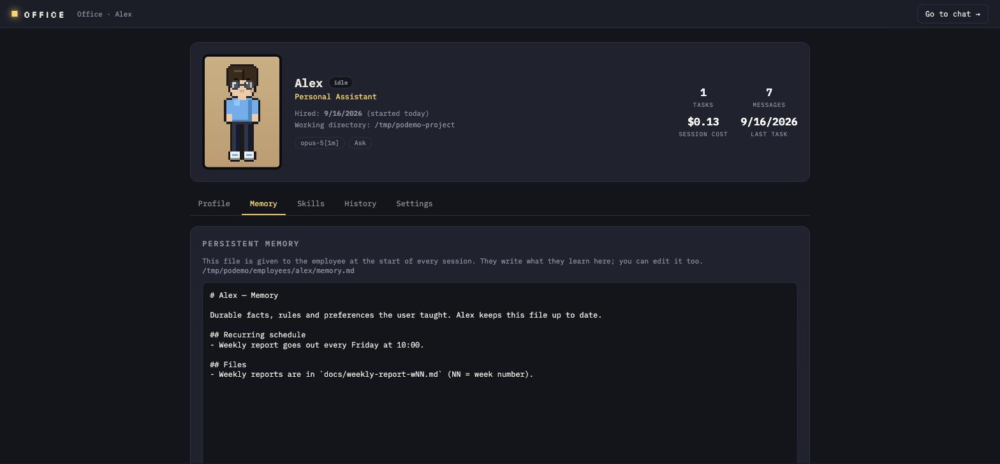
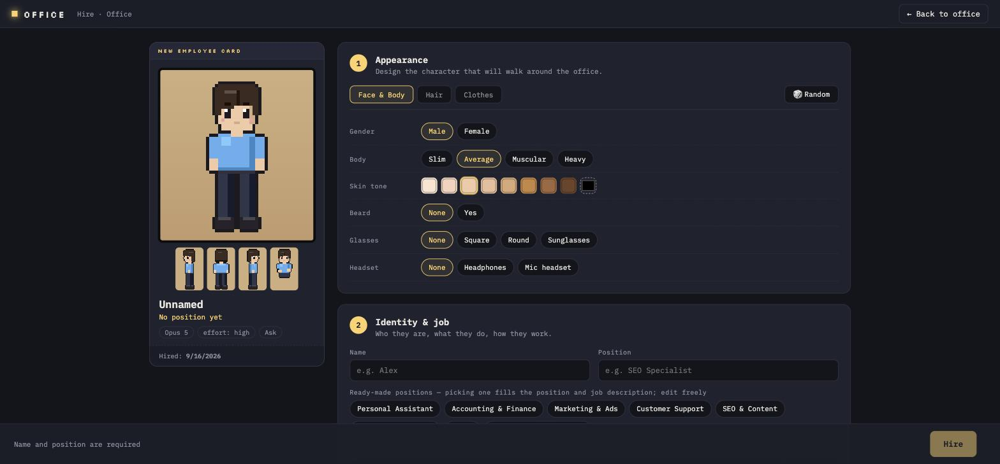
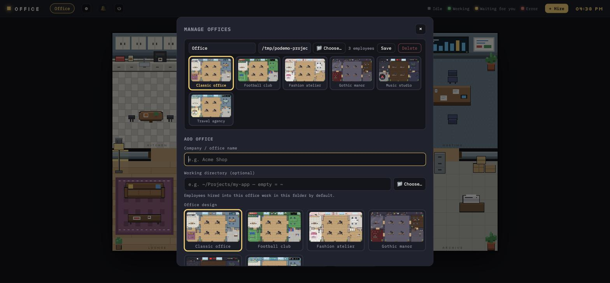

# Pixel Office

**A pixel-art office for your Claude agents.** Hire AI employees with a game-style character creator, give each one a job, watch them walk to their desks and work, and teach them things they never forget.

[](LICENSE) [](#requirements) *Türkçe: [README.tr.md](README.tr.md)*



- **Every employee is a real Claude Code session** with its own job description, persistent memory, skills, model and permission level. They read and edit files, run commands and browse the web inside the folder you give them.
- **Status at a glance.** Working, waiting for your permission, done, unread reply — you see it on the character, on the roster and in the browser tab. Idle employees wander around, grab coffee and chat.
- **Teach once, remember forever.** What you tell an employee goes into a Markdown memory file that is loaded every session and that you can edit yourself.
- **Several companies, one server.** Offices per company or team, each with its own folder, employees and theme (classic, football club, fashion atelier, gothic manor, music studio, travel agency).

## Quick start

Requirements: **Node.js 20+** and **Claude Code** logged in (`claude` CLI — a Claude Pro/Max subscription or an `ANTHROPIC_API_KEY` in your environment).

```bash
npx github:basriayaz/pixel-office
```

That's it. The first run creates `~/.pixel-office/`, hires three sample employees (an assistant, a developer and a marketer) and opens http://localhost:4747 with a short welcome card. Click an employee, say hello.

To install the command permanently:

```bash
git clone https://github.com/basriayaz/pixel-office.git
cd pixel-office && npm install && npm link
pixel-office          # start
pixel-office stop     # stop (or the ⏻ button in the top bar, or Ctrl+C)
```

Works on macOS, Linux and Windows (PowerShell). Switch the language any time from the 🌐 menu in the top bar (the first run picks your OS language). English and Turkish ship today, [add yours](#contributing).

## A tour

### Chat, permissions, memory

Click an employee to open their chat. Replies stream in as Markdown; paste a screenshot with Ctrl+V (or drop an image file) and it goes along with your message; tool calls are collapsed into "N actions" rows; anything that touches your files or runs a command asks first — **Allow**, **Always allow** for this session, or **Deny**. Employees can also ask you multiple-choice questions.



Tell an employee something worth keeping ("remember that our weekly report goes out on Fridays") and they write it to their memory file, then carry on with the task:



The memory file is plain Markdown. Open the profile (☰ in the chat header) to read or edit it, add skills, change the model, or fire the employee:



### Meetings

**👥 Meeting** in the top bar calls a meeting: pick a topic and who joins (busy people either finish first or are interrupted). Everybody walks to the meeting room and the chat panel becomes the meeting panel. What you write goes to the whole room; each employee answers in up to three sentences or passes, and hears what the others said with the next round. `@name` addresses one person (click a name to insert it). Someone with more to say raises a hand — ✋ over their head and a card in the panel — and **Give the floor** lets them speak at length. **End** writes a summary with decisions and follow-up tasks; each task has a **Send** button that hands it to its owner, the summary lands in every participant's chat and, if you leave the box ticked, in their memory. Every message runs one turn per participant, so a big room costs accordingly. Past meetings stay under 🕘.

### Hiring

**+ Hire** opens a character creator: gender, body type, skin, eye color, 14 hair styles (from bald and balding to mohawk, afro and braid), beards (stubble, mustache, goatee, circle, full, long) with their own color, glasses, headset, hats (cap, beanie, cowboy, fedora, bucket, beret, bandana, hood), tops (t-shirt, tank top, crop top, polo, shirt, sweater, hoodie, blazer, suit with tie, dress), bottoms (pants, cargo, joggers, shorts, long shorts, skirt, long skirt), shoes (classic, sneakers, high-tops, boots, loafers, sandals, heels) with their own color. Pick one of the ready-made positions or write your own job description, choose model / effort / permission mode, hire. The new colleague walks in through the door with confetti and sits down at a free desk (up to 12 desks per office).



Ready-made positions (each comes with a job description you can edit): Personal Assistant, Accounting & Finance, Marketing & Ads, Customer Support, SEO & Content, Software Developer, Sales, Content & Social Media, Manager / Team Lead, Marketing Manager, Human Resources, Project Manager, Product Manager, Data Analyst, UI/UX Designer, Legal & Compliance, Operations.

### Offices and themes

The ⚙ button next to the office tabs manages offices: add one per company or team (name, working folder chosen with a native folder dialog, theme), rename, change theme, delete when empty. Themes are picked from rendered previews:



## How it works

Each employee is a folder:

```
~/.pixel-office/
  config.json
  employees/
    _template/
    alex/
      agent.md        # identity + job description (YAML frontmatter + system prompt)
      memory.md       # persistent memory — the employee writes here, you can edit it too
      skills/
        weekly-report/SKILL.md
  data/               # sessions and chat history
```

**`agent.md`** — frontmatter holds `name`, `role`, `color`, `hired`, `model`, `effort`, `permissionMode`, `cwd`, `tools`, `refreshHours` and the `look` (JSON); the body is the system prompt. Edit the file or use the profile page, both work.

**`memory.md`** — loaded into the system prompt at the start of every session. Every employee is instructed to append durable lessons after each task (rules, preferences, where things live). When idle, and `refreshHours` (default 24) have passed since their last refresh, they re-read their memory and the project docs and tidy them up. **Refresh knowledge** on the profile triggers it by hand. Reset a chat (⟲) and the memory stays.

**`skills/<name>/SKILL.md`** — Claude Code skills loaded only for that employee (a checklist, a report format, a deployment procedure). Managed from the profile's Skills tab.

**Sessions** — each chat is a resumable Claude Agent SDK session. The server keeps it alive across restarts; ■ interrupts the current turn; the model and cost of the session show in the chat header.

**Permissions** — `default` asks before every file edit and command (recommended), `acceptEdits` auto-approves file edits, `plan` is read-only, `bypassPermissions` runs everything without asking — only for narrowly scoped, trusted employees. "Always allow" in a permission card applies for the rest of the session.

**Colleagues** — employees in the same office can talk to each other through two built-in tools, `list_colleagues` and `message_colleague`. A support employee can hand an order cancellation to the person who owns orders, optionally wait for their answer and report back to you. The message appears in both chats.

**Notifications** — 🔔 in the top bar turns on desktop notifications for replies and permission requests while the tab is in the background. Clicking one opens that chat.

**Terminal** — employees are also mirrored into `<working folder>/.claude/agents/<id>.md`, so a plain `claude` session in the same project can delegate to them as subagents. They share the same memory files.

## Where files live

Two modes, chosen automatically:

| mode | when | files | employees work in |
|---|---|---|---|
| **global** (default) | run `pixel-office` anywhere | `~/.pixel-office/` (or `$PIXEL_OFFICE_HOME`) | your home folder, unless the office or employee sets a working folder |
| **project** | the current folder has `.pixel-office/config.json` (created by `pixel-office init`), or `--dir <project>` | `<project>/.pixel-office/` | the project folder |

Project mode is for teams: commit `.pixel-office/employees/` and your colleagues get the same employees (and what they've learned) with the repo. Keep memories private with `pixel-office init --no-memory-git`.

### `config.json`

| key | default | meaning |
|---|---|---|
| `locale` | `"en"` | UI + prompt language (`en`, `tr`) |
| `port` | `4747` | HTTP port (`PORT` env overrides) |
| `host` | `"127.0.0.1"` | bind address — keep it on localhost, employees can run commands on your machine |
| `employeesDir` | `employees` / `.pixel-office/employees` | where employee folders live |
| `dataDir` | `data` / `.pixel-office/data` | sessions, chat history, refresh timestamps |
| `memoryFile` | `"memory.md"` | memory file name inside each employee folder |
| `cwd` | home / project | default working folder for employees |
| `syncClaudeAgents` | `true` | mirror employees into `<cwd>/.claude/agents/` |
| `refreshHours` | `24` | how often idle employees revisit their memory and project docs |
| `sickness` | `true` | now and then an idle employee catches a cold and rests on the sofa for 3–5 minutes; messages wait, the 💊 button sends them back early |
| `offices` | – | list of offices (see below); omit for a single office |

Paths are relative to the folder that holds `config.json` (global) or to the project (project mode); `~` works everywhere.

```json
{
  "locale": "en",
  "offices": [
    { "id": "core", "name": "Core",       "employeesDir": "employees/core", "theme": "default" },
    { "id": "shop", "name": "Web Shop",   "employeesDir": "employees/shop", "cwd": "~/Projects/shop", "theme": "fashion" },
    { "id": "app",  "name": "Mobile App", "employeesDir": "employees/app",  "cwd": "~/Projects/app",  "theme": "music",
      "employees": ["employees/core/alex"] }
  ]
}
```

`employees` lists extra employee folders to show in that office too — the same person (same memory and skills) working in two offices, each with its own chat.

### CLI

```
pixel-office                      start your office and open the browser
pixel-office stop                 stop it
pixel-office init [--locale tr]   keep employees inside THIS project instead (.pixel-office/)
pixel-office --dir <project>      start the office of a specific project
options: --port 4747  --no-open  --global  --no-memory-git (with init)
env:     PORT, PIXEL_OFFICE_HOME, PIXEL_OFFICE_LOCALE (first run), PIXEL_OFFICE_SAMPLES=0 (no sample employees)
```

## Troubleshooting

- **"Claude Code is not logged in" / auth errors** — run `claude` once in a terminal and log in, or export `ANTHROPIC_API_KEY`. The Agent SDK bundles the Claude Code runtime; nothing else to install.
- **Port already in use** — `pixel-office --port 4848`, or `pixel-office stop` if an old instance is still running.
- **The employee just sits there** — check the chat: they are probably waiting for a permission. Turn on 🔔 to get notified.
- **Windows** — use PowerShell or Windows Terminal; the folder picker uses the native Windows dialog. Paths like `~/Projects/x` are expanded to your user profile.
- **Reset everything** — stop the server and delete `~/.pixel-office/` (or `.pixel-office/` in the project).

## Security notes

Employees are Claude Code sessions with file and shell access to their working folder (and, with your permission, anything else on the machine). The server therefore binds to `127.0.0.1` and has no authentication — do not expose it to a network. `bypassPermissions` runs commands without asking; use it only for narrowly scoped, trusted employees. Chat history and memories are plain files on your disk; nothing is sent anywhere except to Anthropic through Claude Code.

## Contributing

Issues and pull requests are welcome — see [CONTRIBUTING.md](CONTRIBUTING.md). Adding a language is a single file: copy `locales/en.json` to `locales/<code>.json`, translate, and set `"locale": "<code>"`. New themes and props live in `web/office.js`; `web/sprites.html` renders every character frame at 4× while you tweak sprites.

```bash
npm run dev          # tsx, no build step
npm run typecheck
```

## Credits

Made by [Basri Ayaz](https://github.com/basriayaz). Built on the [Claude Agent SDK](https://code.claude.com/docs/en/agent-sdk). MIT licensed — see [LICENSE](LICENSE).
