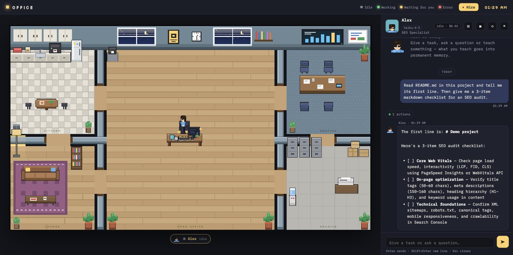
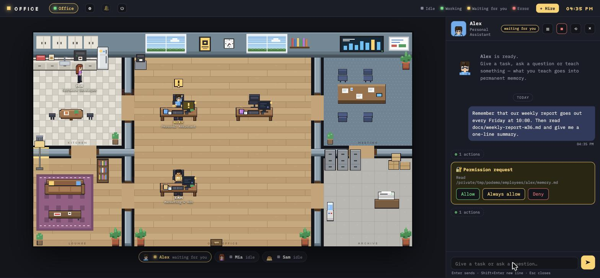
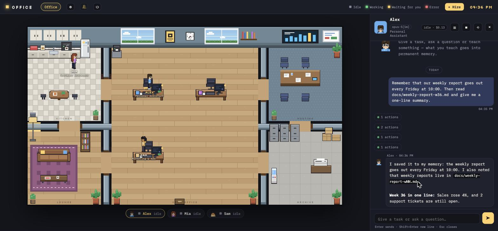
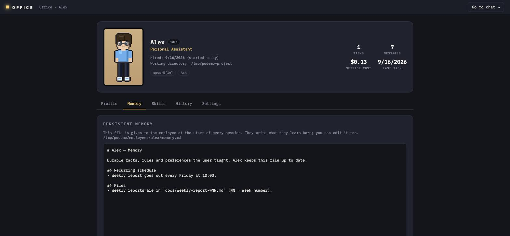
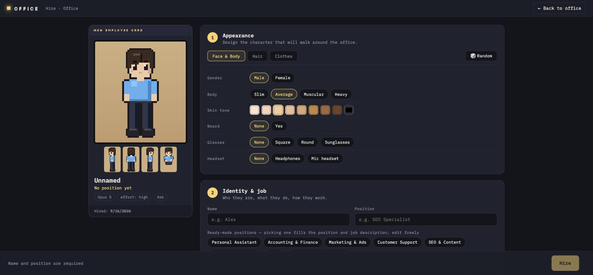
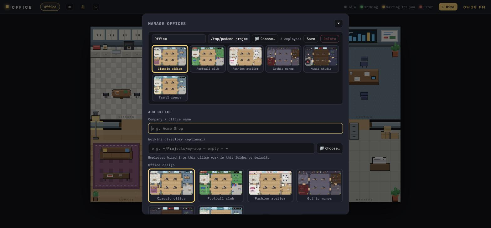

# Pixel Office

**AI agent'ların için pixel-art bir ofis.** Oyun tarzı karakter oluşturucuyla AI çalışanlar işe al, her birine bir iş ver, masalarına yürüyüp çalışmalarını izle ve onlara asla unutmayacakları şeyler öğret.

[](LICENSE) [](#hızlı-başlangıç) *English: [README.md](README.md)*



- **Her çalışan Claude, Codex, Gemini veya OpenRouter üzerinden çalışan bir AI agent**: kendi görev tanımı, kalıcı hafızası, yetenekleri, modeli ve izin seviyesi var. Verdiğin klasörde dosya okur ve düzenler, komut çalıştırır, web'e bakar.
- **Durum bir bakışta**: çalışıyor, iznini bekliyor, bitti, okunmamış cevap — karakterin üstünde, listede ve tarayıcı sekmesinde görürsün. Boştakiler dolaşır, kahve alır, sohbet eder.
- **Bir kez öğret, hep hatırlasın.** Çalışana söylediğin şey her oturumda yüklenen bir Markdown hafıza dosyasına yazılır; sen de düzenleyebilirsin.
- **Birden fazla şirket, tek sunucu.** Şirket ya da ekip başına ofis; her birinin kendi klasörü, çalışanları ve teması (klasik, futbol kulübü, moda atölyesi, gotik malikâne, müzik stüdyosu, seyahat acentesi, rüya atölyesi).

## Hızlı başlangıç

Gereksinimler: **Node.js 20+** (`node --version`) ve aşağıdaki sağlayıcılardan **birine** erişim. GitHub üzerinden kurulum komutu için Git de kurulu olmalı.

```bash
npx github:basriayaz/pixel-office
```

Yeni bir global kurulumda `~/.pixel-office/` oluşturulur, üç örnek çalışan alınır ve http://localhost:4747 açılır. Tarayıcı açılmazsa bu adresi ziyaret et. Ofisin açılması ilk adımdır; görev göndermeden önce bir sağlayıcı bağla.

1. **Sağlayıcı bağla:** **⚙ Ayarlar → Modeller** bölümünü aç. Aşağıdaki ilgili kartı kullan, **Bu motoru kullan** seçili kalsın; ardından **Yeniden kontrol et** düğmesine bas ve **Bağlı** durumunu gör.

   | Sağlayıcı | Kartındaki kurulum adımları |
   |---|---|
   | Claude | Eksikse **Kur**, ardından **Giriş yap** ile Claude Code oturumunu aç; alternatif olarak sunucuyu ortamında `ANTHROPIC_API_KEY` tanımlı şekilde başlat. |
   | Codex | Eksikse **Kur**, ardından **Giriş yap** ile Codex CLI oturumunu aç. |
   | Gemini | Eksikse Gemini CLI'yi **Kur**; Gemini API anahtarını girip **Anahtarı kaydet** düğmesine bas (veya `GEMINI_API_KEY` / `GOOGLE_API_KEY` ile başlat). |
   | OpenRouter | OpenRouter API anahtarını girip **Anahtarı kaydet** düğmesine bas (veya `OPENROUTER_API_KEY` ile başlat). Araç kullanımını destekleyen bir modelin OpenRouter kimliğini **Ek model kimlikleri** alanına ekle ve **Modelleri kaydet** düğmesine bas. Ayrı CLI kurulumu gerekmez. |

   Bir çalışan seç, profilini aç (**☰ → Ayarlar**), bağlı sağlayıcıdan bir model seç ve kaydet. Sağlayıcı bağlamak mevcut çalışanın modelini otomatik değiştirmez.

2. **Çalışma klasörünü seç:** **⚙ Ayarlar → Ofisler** bölümünde ofisinin satırını bul, klasör alanına projenin mutlak yolunu gir ve **Kaydet** düğmesine bas. **Global modda, komutu bir proje klasöründen başlatsan bile varsayılan çalışma klasörü ev dizinindir.** Çalışana özel klasör ayarı ofis ayarının önüne geçer; profilinden kontrol et. Proje modu için [Dosyalar nerede?](#dosyalar-nerede) bölümüne bak.

3. **Çalışanın sohbetinde tek bir küçük istek gönder:**

   > Çalışma klasörünün mutlak yolunu ve doğrudan içindeki en fazla beş öğeyi listele. Hiçbir dosyayı değiştirme.

   **Beklenen çıktı:** seçtiğin proje yolunu ve tanıdığın öğeleri içeren bir sohbet yanıtı (klasör boşsa bunun belirtilmesi). İzin kartı çıkarsa klasör okuma işlemini inceleyip izin vererek devam et.

İstek hata verirse veya beklerse sırayla: **Ayarlar → Modeller** (karttaki hatayı oku, kurulumu/girişi tamamla veya anahtarı düzelt, **Yeniden kontrol et**) → **çalışan profili → Ayarlar** (o sağlayıcıdan model seç ve kaydet) → **Ayarlar → Ofisler** ve çalışana özel klasör ayarı (yolu doğrula). Sohbette bekleyen izin isteğini kontrol et, ardından örnek isteği yeniden gönder. **Bağlı** rozeti sağlayıcı durumunu kontrol eder; örnek yanıt ise gerçek bir ajan turunun çalıştığını doğrular. Panel giriş ekranını açamazsa terminalde `claude auth login` veya `codex login` kullan, ardından **Yeniden kontrol et** düğmesine bas.

Komutu kalıcı kurmak için:

```bash
git clone https://github.com/basriayaz/pixel-office.git
cd pixel-office && npm install && npm link
pixel-office          # başlat
pixel-office stop     # kapat (ya da üst bardaki ⏻ düğmesi, ya da Ctrl+C)
```

macOS, Linux ve Windows'ta (PowerShell) çalışır. Dili istediğin zaman üst bardaki 🌐 menüsünden değiştirirsin (ilk açılışta işletim sisteminin dili seçilir).

## Tur

### Sohbet, izinler, hafıza

Çalışana tıkla, sohbeti açılır. Cevaplar Markdown olarak akar; Ctrl+V ile ekran görüntüsü yapıştır (ya da görsel dosyası bırak), mesajınla birlikte gider; araç çağrıları "N işlem" satırlarında katlanır; izin davranışı sağlayıcıya ve seçilen moda bağlıdır. Claude ve OpenRouter izin kartları — **İzin ver**, sunulduğunda **Hep izin ver**, ya da **Reddet** — ve seçenekli sorular gösterebilir. Codex ve Gemini etkileşimli izin kartları olmadan çalışır; yapabileceklerini seçilen mod belirler (bkz. [İzinler](#izinler)).



Kalıcı bir şey söylediğinde ("haftalık rapor cuma günleri çıkar, aklında tut") hafıza dosyasına yazar ve işine devam eder:



Hafıza dosyası düz Markdown. Profili aç (sohbet başlığında ☰): oku, düzenle, yetenek ekle, modeli değiştir ya da çalışanı işten çıkar:



### Toplantı

Üst çubuktaki **👥 Toplantı** düğmesi toplantı çağırır: konuyu ve kimlerin katılacağını seç (meşgul olanlar ya işini bitirip gelir ya da işi kesilir). Herkes toplantı odasına yürür, sohbet paneli toplantı paneline dönüşür. Yazdığın şey tüm odaya gider; her çalışan en fazla üç cümleyle cevap verir ya da pas geçer, diğerlerinin söylediklerini bir sonraki turda duyar. `@isim` tek kişiye hitap eder (isme tıklayınca eklenir). Daha çok anlatacağı olan el kaldırır — başının üstünde ✋, panelde bir kart — ve **Söz ver** ile uzunca konuşur. **Bitir** kararları ve takip görevlerini içeren bir özet yazar; her görevin yanındaki **Gönder** onu sahibine iletir, özet her katılımcının sohbetine ve kutu işaretliyse hafızasına düşer. Her mesaj katılımcı başına bir tur çalıştırır, kalabalık oda o kadar maliyetlidir. Geçmiş toplantılar 🕘 altında durur.

### Pano ve proje yöneticisi

**📋 Pano** ofisteki herkesin paylaştığı iki şeyi tutar. **Ortak defter**, tek bir sohbetin ötesinde önemi olan şeylerin (bulgular, kararlar, rakamlar, riskler) yazıldığı ve işe başlamadan önce arkadaşların bulduklarının okunduğu yerdir; sen de not ekler, düzenler, silersin. **Görev listesi** bir plandır: görevleri sahibiyle birlikte sen ve proje yöneticisi koyarsınız, hiçbir şey kendiliğinden başlamaz. Bir görevde **Başlat**'a bas, bir kişiyi seçip **açık görevleri başlat** de, ya da sohbette panodaki açık işlerini yapmasını söyle. Sahipler her görevi yapılıyor, bitti (kısa sonuç notuyla) ya da takıldı (sebebiyle) olarak işaretler; takılan ve incelemedeki görevler düğmede rozet olarak görünür.

Bir çalışanı **proje yöneticisi** yap (profil → Ayarlar → Proje yöneticisi). Defterin tamamını okur, bir arkadaşının son zamanlarda ne yaptığını onu rahatsız etmeden görür, panoya görev koyar ve sen onay verince başlatır. Doğal döngü: herkes kendi alanını araştırıp not alır → proje yöneticisine durumu, eksikleri ve sıradaki adımı sorarsın → işler çakışmasın diye net sahipli ve kapsamlı görevler önerir → başla dersin → sahipler çalışır ve görevlerini işaretler. Arka planda sürekli kontrol eden bir şey yoktur: proje yöneticisi sadece onunla konuştuğunda tur harcar.

Düzeni korumak için: bir görevde **İnceleme gerekli** kutusunu işaretle (ya da proje yöneticisi işaretlesin), sahibi görevi kapatamaz — biten iş, sen ya da proje yöneticisi **Onayla** ya da **Geri gönder** diyene kadar incelemede bekler. Pano, sahibi senden izin bekleyen, oturumu hata veren, çalışmayı bırakan ya da ofisten ayrılan görevleri işaretler ve 📋 düğmesinde sayar. Toplantı sonrası görevler başlatılmaz, panoya eklenir. Notlar çalışanlara talimat olarak değil bilgi olarak verilir, neredeyse aynı başlıklı notlar kaydedilirken yakalanır.

Aynı depoda aynı anda çalışan geliştiriciler için profillerinde **Ayrı çalışma kopyası** kutusunu işaretle: her biri `.pixel-office/worktrees/<id>` altında, `po/<id>` dalında özel bir git çalışma kopyası alır, oraya commit eder ve görevin sonuç notunda dalı belirtir. Ana dala birleştirme senin işindir (ya da istediğinde proje yöneticisinin). Klasör en az bir commit'i olan bir git deposu olmalıdır; açıldığında o çalışanın sohbeti yeni bir oturumla devam eder.

### İşe alma

**+ İşe al** karakter oluşturucuyu açar: cinsiyet, vücut tipi, ten, göz rengi, 14 saç stili (kel ve dökülmüşten mohawk, afro ve örgüye), kendi rengiyle sakal (kirli, bıyık, keçi, top, tam, uzun), gözlük, kulaklık, şapka (kep, bere, kovboy, fötr, balıkçı, Fransız beresi, bandana, kukuleta), üst (tişört, atlet, crop, polo, gömlek, kazak, hoodie, blazer, kravatlı takım elbise, elbise), alt (pantolon, kargo, eşofman, şort, uzun şort, etek, uzun etek), kendi rengiyle ayakkabı (klasik, spor, bilekli spor, bot, makosen, sandalet, topuklu). Hazır pozisyonlardan birini seç ya da görev tanımını kendin yaz, model / effort / izin modunu belirle, işe al. Yeni çalışan kapıdan konfetiyle girer ve boş bir masaya oturur (ofis başına 12 masa).



Hazır pozisyonlar (her birinin düzenlenebilir görev tanımı var): Kişisel Asistan, Muhasebe & Finans, Reklam & Pazarlama, Müşteri Destek, SEO & İçerik, Yazılım Geliştirme, Satış, İçerik & Sosyal Medya, Müdür / Ekip Lideri, Pazarlama Müdürü, İnsan Kaynakları, Proje Yöneticisi, Ürün Yöneticisi, Veri Analisti, UI/UX Tasarımcı, Hukuk & Uyum, Operasyon, Mobil Geliştirici, Frontend Geliştirici, Backend Geliştirici, DevOps Mühendisi, Test Mühendisi (QA), Yapay Zekâ / ML Mühendisi, Veri Mühendisi, Grafik Tasarımcı, Pazar & Rakip Analisti, İş Analisti, İş Geliştirme, Büyüme Yöneticisi, Strateji Danışmanı, PR & İletişim, Topluluk Yöneticisi, Metin Yazarı, E-ticaret Yöneticisi.

### Ofisler ve temalar

Sekmelerin yanındaki ⚙ ofisleri yönetir: şirket ya da ekip başına ofis ekle (ad, Finder'dan seçilen çalışma klasörü, tema), yeniden adlandır, tema değiştir, boşsa sil. Temalar çizilmiş önizlemelerden seçilir:



## Nasıl çalışır

Her çalışan bir klasördür:

```
~/.pixel-office/
  config.json
  employees/
    _template/
    kerem/
      agent.md        # kimlik + görev tanımı (YAML frontmatter + sistem promptu)
      memory.md       # kalıcı hafıza — çalışan buraya yazar, sen de düzenleyebilirsin
      skills/
        haftalik-rapor/SKILL.md
  data/               # oturumlar ve sohbet geçmişi
```

**`agent.md`** — frontmatter'da `name`, `role`, `color`, `hired`, `model`, `effort`, `permissionMode`, `cwd`, `tools`, `refreshHours` ve `look` (JSON); gövde sistem promptu. Dosyayı elle ya da profil sayfasından düzenleyebilirsin.

**`memory.md`** — her oturumun başında sistem promptuna yüklenir. Her çalışan, her görev sonunda kalıcı dersleri (kurallar, tercihler, neyin nerede olduğu) buraya eklemesi için yönlendirilir. Boştayken ve son tazelemeden `refreshHours` (varsayılan 24) geçtiyse hafızasını ve proje dokümanlarını yeniden okuyup toparlar. Profildeki **Bilgilerini tazele** elle tetikler. Sohbeti sıfırlarsan (⟲) hafıza kalır.

**`skills/<ad>/SKILL.md`** — sadece o çalışana yüklenen Claude Code yetenekleri (bir kontrol listesi, rapor formatı, deploy adımları). Profilin Yetenekler sekmesinden yönetilir.

**Oturumlar** — Claude sohbetleri Claude Agent SDK kullanır; OpenRouter aynı SDK’yı OpenRouter’ın Anthropic uyumlu uç noktasıyla kullanır. Codex her turda bir `codex exec` süreci çalıştırır ve thread kimliğiyle devam eder; Gemini her turda bir CLI süreci çalıştırır ve oturum kimliğiyle devam eder. Sunucu sohbet oturum/thread kimliklerini kaydeder ve yeniden başlatıldıktan sonra devam etmek için kullanır; çalışmakta olan turu ayakta tutmaz. Kayıtlı oturum bulunamazsa özetle yeni bir oturum başlar. ■ o turu keser; model ve kaydedilen oturum maliyeti sohbet başlığında görünür (aşağıdaki Token fiyatları bölümüne bak).

**Token fiyatları** — Codex ve Gemini para değil token bildirir; maliyetleri yerleşik bir fiyat tablosundan tahmin edilir (1M token başına USD; ChatGPT planındaki Codex için API karşılığıdır, fatura çıkmaz). Sağlayıcı fiyat değiştirir ya da yeni model çıkarsa kendi satırlarını `<dataDir>/prices.json` dosyasına yaz — örn. `{"codex": [{"match": "gpt-6", "input": 2, "cached": 0.2, "output": 16}], "gemini": []}`; `match` model kimliğine uygulanan, büyük/küçük harf duyarsız bir regex; senin satırların yerleşiklerden önce denenir, `cached` verilmezse `input` kullanılır. Dosya yeniden başlatmadan okunur; `GET/PUT /api/prices` okur ve yazar (PUT adı geçen motorların satırlarını değiştirir, hatalı satırda 400).

<a id="izinler"></a>
**İzinler** — profildeki aynı ayar her sağlayıcıda farklı davranışa karşılık gelir:

| Sağlayıcı | `default` | `acceptEdits` | `plan` | `bypassPermissions` |
| --- | --- | --- | --- | --- |
| Claude | SDK izin denetimleri; mevcut kurallara göre onay gerektiren işlemde sorar | SDK dosya düzenlemelerini otomatik onaylar; diğer işlemler izin kurallarına tabidir | SDK planlama modu | SDK izin denetimlerini atlar |
| OpenRouter | Claude ile aynı SDK izin akışı | Claude ile aynı | Claude ile aynı | Claude ile aynı |
| Codex | `workspace-write` sandbox | `default` ile aynı | `read-only` sandbox | Onayları ve sandbox’ı atlar |
| Gemini | `auto_edit`: düzenlemeleri otomatik onaylar; hâlâ onay gerektiren işlemleri reddeder | `default` ile aynı | CLI `plan` modu | CLI `yolo` modu: işlemleri otomatik onaylar |

Claude/OpenRouter izin kartları yalnızca SDK onay istediğinde çıkar; izinli araçlar ve mevcut kurallar sorulmadan çalışabilir. **Hep izin ver** yalnızca SDK yeniden kullanılabilir bir izin kuralı sunduğunda gösterilir; sunucu kuralı SDK’nın belirttiği kapsamla SDK’ya geri iletir. Codex ve Gemini bu entegrasyonda durup onay isteyemez. Codex’in `workspace-write` modu çalışma klasörüne ve çalışan dizinine yazmaya izin verir; ağ erişimi açıktır. Ofis araçları dört sağlayıcıda da önceden onaylıdır. `bypassPermissions` yalnızca dar görevli, güvendiğin çalışanlar için kullanılmalıdır.

**Meslektaşlar** — aynı ofisteki çalışanlar `list_colleagues` ve `message_colleague` araçlarıyla birbirine yazar. Destek çalışanı bir sipariş iptalini siparişlerden sorumlu kişiye devreder, istersen cevabını bekleyip sana rapor eder. Mesaj iki sohbette de görünür.

**Bildirimler** — üst bardaki 🔔, sekme arkadayken cevaplar ve izin istekleri için masaüstü bildirimi açar. Bildirime tıklayınca o sohbet açılır.

**Terminal** — çalışanlar `<çalışma klasörü>/.claude/agents/<id>.md` olarak da yansıtılır; aynı projede açtığın `claude` onlara subagent olarak iş devredebilir. Aynı hafıza dosyalarını paylaşırlar.

## Dosyalar nerede

İki mod, otomatik seçilir:

| mod | ne zaman | dosyalar | çalışanlar nerede çalışır |
|---|---|---|---|
| **global** (varsayılan) | herhangi bir yerde `pixel-office` | `~/.pixel-office/` (ya da `$PIXEL_OFFICE_HOME`) | ofis ya da çalışan klasör seçmediyse ev dizini |
| **proje** | bulunduğun klasörde `.pixel-office/config.json` varsa (`pixel-office init` oluşturur) ya da `--dir <proje>` | `<proje>/.pixel-office/` | proje klasörü |

Proje modu ekipler için: `.pixel-office/employees/` klasörünü commit'lersen ekip arkadaşların aynı çalışanları (ve öğrendiklerini) repoyla alır. Hafızalar kişisel kalsın istersen `pixel-office init --no-memory-git`.

### `config.json`

| anahtar | varsayılan | anlamı |
|---|---|---|
| `locale` | `"en"` | arayüz + prompt dili (`en`, `tr`) |
| `port` | `4747` | HTTP portu (`PORT` ortam değişkeni geçersiz kılar) |
| `host` | `"127.0.0.1"` | dinlenen adres — localhost'ta tut, çalışanlar makinende komut çalıştırabilir |
| `employeesDir` | `employees` / `.pixel-office/employees` | çalışan klasörleri |
| `dataDir` | `data` / `.pixel-office/data` | oturumlar, sohbet geçmişi, tazeleme zamanları |
| `memoryFile` | `"memory.md"` | hafıza dosyasının adı (örn. `hafiza.md`) |
| `cwd` | ev / proje | çalışanların varsayılan çalışma klasörü |
| `syncClaudeAgents` | `true` | çalışanları `<cwd>/.claude/agents/` altına yansıt |
| `refreshHours` | `24` | boştaki çalışanların hafıza ve dokümanları ne sıklıkla gözden geçireceği |
| `sickness` | `true` | arada boştaki bir çalışan hastalanır ve 3–5 dakika kanepede dinlenir; mesajlar bekler, 💊 düğmesi erken işe döndürür |
| `offices` | – | ofis listesi (aşağıda); tek ofis için yazma |

Yollar `config.json`'ın bulunduğu klasöre (global) ya da projeye (proje modu) göredir; `~` her yerde çalışır.

```json
{
  "locale": "tr",
  "memoryFile": "hafiza.md",
  "offices": [
    { "id": "genel", "name": "Genel",   "employeesDir": "employees/genel", "theme": "default" },
    { "id": "carpe", "name": "Carpe",   "employeesDir": "employees/carpe", "cwd": "~/Projects/carpe", "theme": "fashion" },
    { "id": "muzik", "name": "Müzik",   "employeesDir": "employees/muzik", "cwd": "~/Projects/kanal",  "theme": "music",
      "employees": ["employees/genel/defne"] }
  ]
}
```

`employees`, o ofiste ek olarak gösterilecek çalışan klasörlerini listeler — aynı kişi (aynı hafıza ve yetenekler) iki ofiste, her birinde ayrı sohbetle çalışır.

### Komutlar

```
pixel-office                      ofisini başlatır ve tarayıcıyı açar
pixel-office stop                 kapatır
pixel-office init [--locale tr]   çalışanları BU projenin içinde tutar (.pixel-office/)
pixel-office --dir <proje>        belirli bir projenin ofisini açar
seçenekler: --port 4747  --no-open  --global  --no-memory-git (init ile)
ortam:      PORT, PIXEL_OFFICE_HOME, PIXEL_OFFICE_LOCALE (ilk açılış), PIXEL_OFFICE_SAMPLES=0 (örnek çalışan olmasın)
```

## Sorun giderme

- **"Claude Code'a giriş yapılmamış" / yetki hataları** — terminalde bir kez `claude` çalıştırıp giriş yap, ya da `ANTHROPIC_API_KEY` tanımla. Agent SDK Claude Code çalışma zamanını kendi içinde taşır; başka kurulum yok.
- **Port dolu** — `pixel-office --port 4848`, ya da eski bir örnek çalışıyorsa `pixel-office stop`.
- **Çalışan öylece oturuyor** — sohbete bak, büyük ihtimalle izin bekliyor. 🔔 ile bildirim aç.
- **Windows** — PowerShell ya da Windows Terminal kullan; klasör seçici Windows'un kendi penceresini açar. `~/Projects/x` gibi yollar kullanıcı profiline açılır.
- **Her şeyi sıfırla** — sunucuyu durdur, `~/.pixel-office/` (ya da projedeki `.pixel-office/`) klasörünü sil.

## Güvenlik notları

Çalışanlar Claude, Codex, Gemini veya OpenRouter kullanır; seçilen motor ve izin moduna göre dosyalara erişebilir ve kabuk komutları çalıştırabilir (bkz. [İzinler](#izinler)). Çalışma klasörü tüm motorlar için geçerli bir güvenlik sınırı değildir. Sunucu varsayılan olarak `127.0.0.1`'e bağlanır ve kullanıcı girişiyle kimlik doğrulaması yoktur; ağa açma. `bypassPermissions` modunu yalnızca dar görevli, güvendiğin çalışanlarda kullan; bu mod onay sorularını atlar ve Codex'te sandbox'ı da kapatır.

Sohbet geçmişi ve hafızalar diskinde düz dosyalarda tutulur. Yerel kayıt, işlemenin yalnızca yerelde yapıldığı anlamına gelmez: mesajlar, çalışan talimatları ve hafızası, konuşma bağlamı ve model bağlamına eklenen dosya içerikleri, görseller veya araç sonuçları seçilen sağlayıcının yolu üzerinden gönderilir:

| Sağlayıcı | Model isteğinin izlediği yol |
| --- | --- |
| Claude | Claude Agent SDK (Claude Code) → Anthropic. |
| Codex | `codex exec` CLI → OpenAI. |
| Gemini | Tanımlı Gemini API anahtarıyla Gemini CLI → Google. |
| OpenRouter | Claude Agent SDK → OpenRouter'ın Anthropic uyumlu API'si (`https://openrouter.ai/api`) → OpenRouter yönlendirmesinin seçtiği model sağlayıcısı. Claude SDK kullanılması, bu yolun yalnızca Anthropic'e gittiği anlamına gelmez. |

Bunlar uygulamanın sağlayıcı yollarıdır; özel çalışma zamanı veya ortam ayarları uç noktaları etkileyebilir. Araçlar, kabuk komutları ve yapılandırılmış MCP sunucuları/bağlayıcılar başka servislerle de iletişim kurabilir. Verilerin nasıl işlendiği ilgili servislere ve hesap ayarlarına bağlıdır; Pixel Office verilerin makinenizde kalacağını veya yalnızca Anthropic'e gideceğini garanti etmez.

## Katkı

Issue ve pull request'ler açık — bkz. [CONTRIBUTING.md](CONTRIBUTING.md). Yeni dil eklemek tek dosya: `locales/en.json`'ı `locales/<kod>.json` olarak kopyala, çevir, `"locale": "<kod>"` yaz. Yeni temalar ve eşyalar `web/office.js` içinde; `web/sprites.html` sprite'larla oynarken tüm kareleri 4× çizer.

```bash
npm run dev          # tsx, derleme adımı yok
npm run typecheck
```

## Emeği geçen

[Basri Ayaz](https://github.com/basriayaz) yaptı. [Claude Agent SDK](https://code.claude.com/docs/en/agent-sdk) üzerine kurulu. MIT lisanslı — bkz. [LICENSE](LICENSE).
